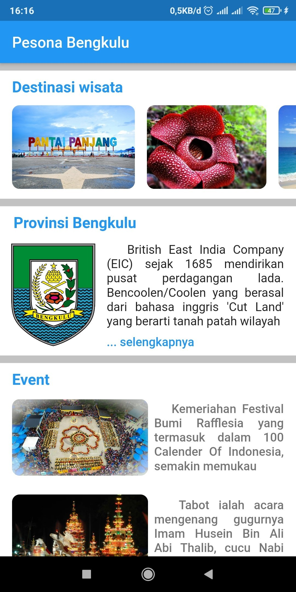
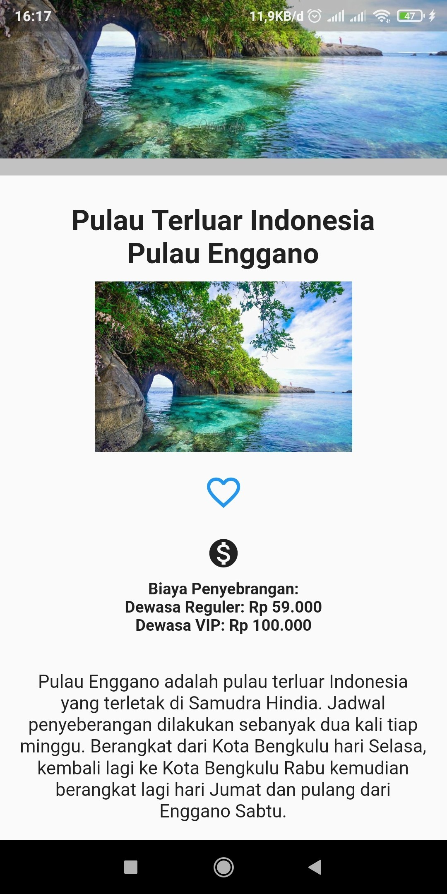
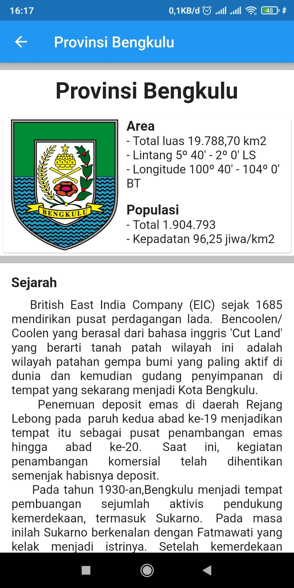

# Pesona Bengkulu
 Pesona Bengkulu adalah aplikasi mobile yang menampilkan berbagai informasi mengenai provinsi Bengkulu seperti destinasi wisata, sejarah, dan juga event-event yang ada. Aplikasi ini dikembangkan menggunakan framework flutter dan dibuat dalam rangka menyelesaikan submission akhir dari kelas <a href="https://www.dicoding.com/academies/159" ><b>Belajar Membuat Aplikasi Flutter untuk Pemula</b></a> yang diselenggarakan oleh <a href="https://www.dicoding.com/" ><b>Dicoding</b></a>.

## Branch
Berikut penjelasan branch yang ada pada repository :
* **master** : Source code submission akhir
* **learn** : Source code playground
* **codelab1** : Source code Codelab 1 dicoding
* **codelab2** : Source code Codelab 2 dicoding
* **codelab3** : Source code Codelab 3 dicoding

## Screenshots

